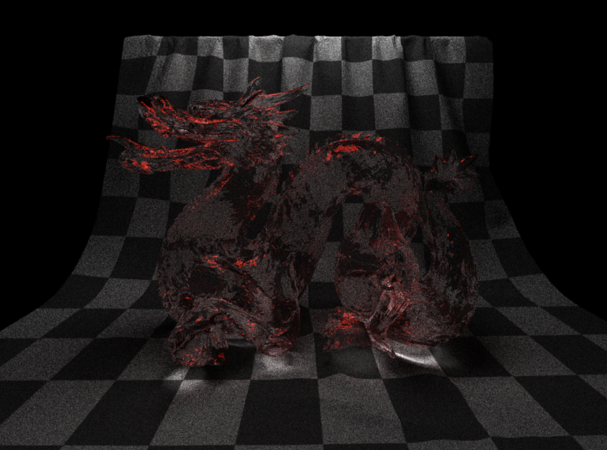
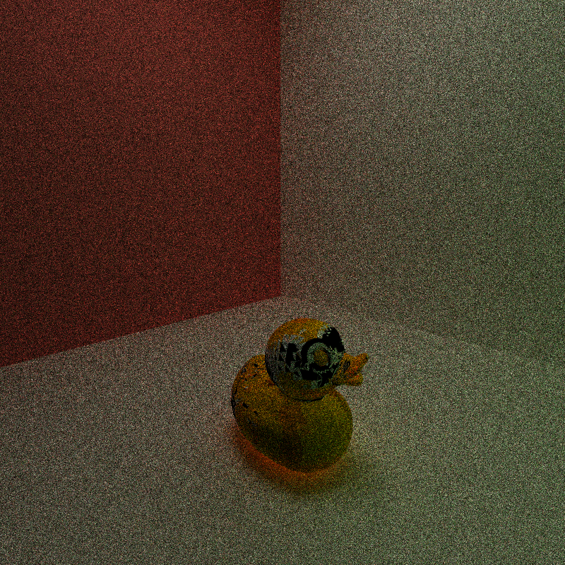
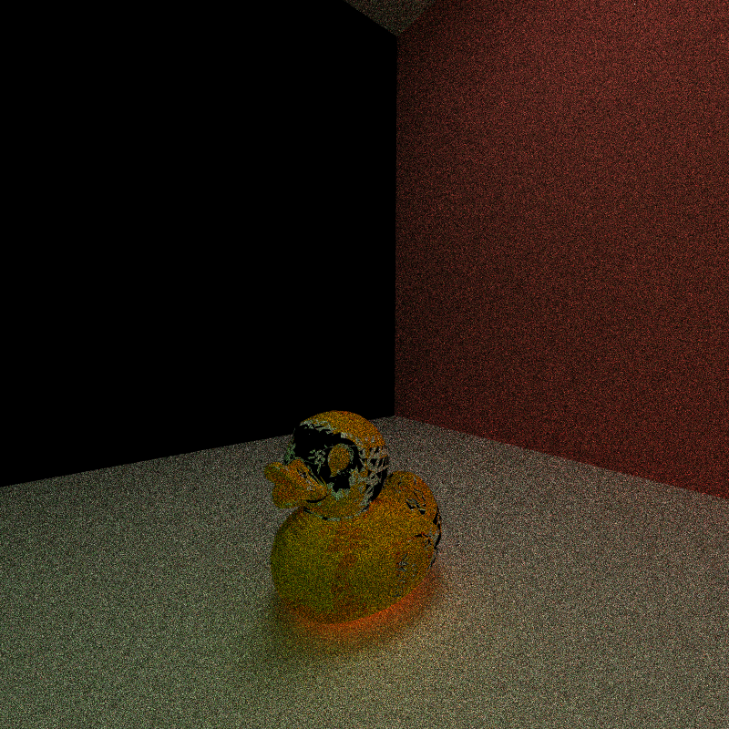
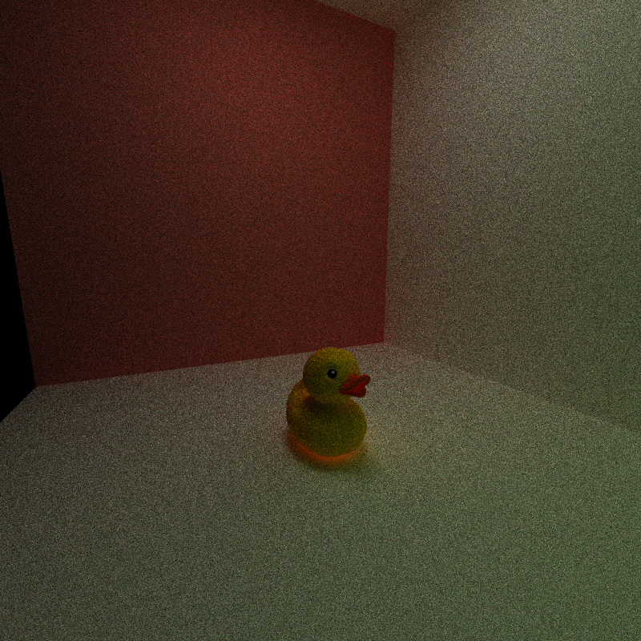

CUDA Path Tracer
================

**University of Pennsylvania, CIS 565: GPU Programming and Architecture, Project 3**

* Marcus Hedlund
  * [LinkedIn](https://www.linkedin.com/in/marcushedlund/)
* Tested on: Windows 11, Intel Core Ultra 9 185H @ 2.5 GHz 16GB, NVIDIA GeForce RTX 4070 Laptop GPU 8GB (Personal Computer)

||
|:--:|
|*Glass Dragon render. Model from KhronosGroup gltf models. Replace with cooler scenes later :D*|

# Table of Contents

Features:
* Core: 
    * Basic CUDA path tracer
    * BSDF kernel for ideal diffuse surfaces
    * Making rays/pathSegments/intersections contiguous in memory by material type
    * Stochastic sampled antialiasing
* Additional
    * Refraction
    * Texture mapping 
    * Arbitrary mesh loading: gltf
    * Octree hierarchical spatial data structure
    * Russian roulette path termination

# Overview

# Performance Analysis

# Bloopers

||
|:--:|
|*Messed up mesh loading*|

||
|:--:|
|*Messed up mesh loading*|

||
|:--:|
|*How he's supposed to look :D*|