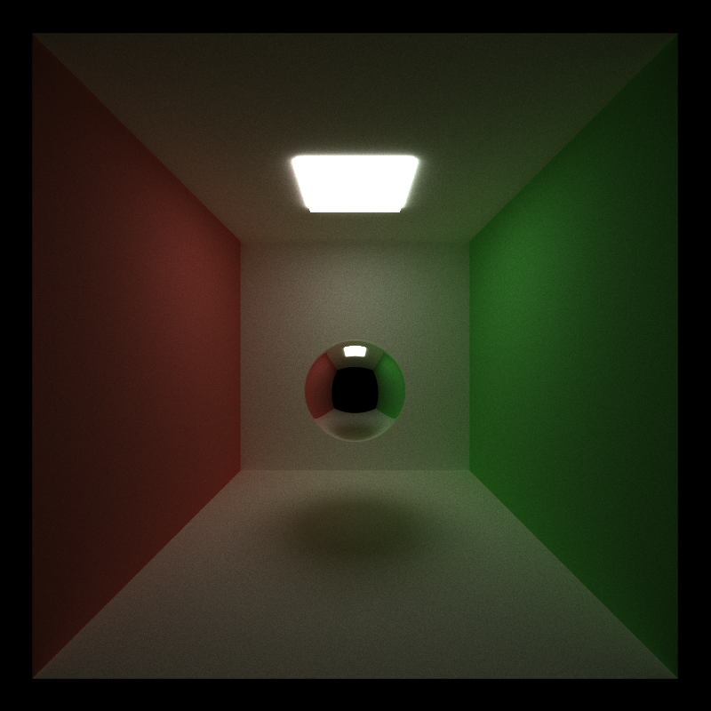

CUDA Path Tracer
================

**University of Pennsylvania, CIS 565: GPU Programming and Architecture, Project 3**

* Marcus Hedlund
  * [LinkedIn](https://www.linkedin.com/in/marcushedlund/)
* Tested on: Windows 11, Intel Core Ultra 9 185H @ 2.5 GHz 16GB, NVIDIA GeForce RTX 4070 Laptop GPU 8GB (Personal Computer)

||
|:--:|
|*Glass Dragon Render. Model from KhronosGroup gltf models.*|

# Overview

In this project I build a CUDA-accelerated path tracer that simulates physically based lighting by tracing many stochastic light paths through a scene. It supports diffuse, reflective, and refractive materials, textured glTF meshes, and anti-aliasing, while accelerating runtime with path segment sorting, stream compaction, Russian roulette, and an octree for fast ray–scene queries.

# Table of Contents

- [Overview](#overview)
- [Features](#table-of-contents)
  - [Core](#core)
    - [BSDF Kernel for Ideal Diffuse Surfaces](#bsdf-kernel-for-ideal-diffuse-surfaces)
    - [Stochastic Sampled Antialiasing](#stochastic-sampled-antialiasing)
    - [Stream Compacted Path Termination](#stream-compacted-path-termination)
    - [Sorting Memory by Material Type](#sorting-memory-by-material-type)
  - [Visual Improvements](#visual-improvements)
    - [Reflection and Refraction](#reflection-and-refraction)
    - [Texture Mapping](#texture-mapping)
  - [Mesh Improvements](#mesh-improvements)
    - [Arbitrary GLTF File Mesh Loading](#arbitrary-gltf-file-mesh-loading)
  - [Performance Improvements](#performance-improvements)
    - [Russian Roulette Path Termination](#russian-roulette-path-termination)
    - [Octree Hierarchical Spatial Data Structure](#octree-hierarchical-spatial-data-structure)
- [Bloopers](#bloopers)
- [Resources](#resources)

## Core
### BSDF Kernel for Ideal Diffuse Surfaces
The basic shading kernel I implement first for the path tracer is only for ideal diffuse surfaces without any specular or more complex shading and uses Bidirectional Scattering Distribution Functions (BSDF). This uses a cosine weighted scatter function around the hemisphere of a ray's perfect reflection to determine how the ray will bounce off of scene objects and gives materials a matte appearance.

### Stochastic Sampled Antialiasing
Aliasing is an effect that happens when rendering to pixels that causes edges of objects to become jagged. To reduce this we implement stochastic sampled antialiasing which jitters the rays within each pixel every iteration. This means that as iterations increase and we can average the final pixel color over all the rays cast through that pixel in each iteration it smoothes out the pixel color and prevents the aliasing. 

### Stream Compacted Path Termination
In stream compaction, after every ray bounce, dead paths (ones that missed all scene objects, or in the future were terminated by russian roulette optimization) are separated out via a stream compaction algorithm so that future kernels only launch on surviving rays. This can greatly reduce necessary computations when rendering scenes when rays can die quickly without affecting the render quality at all (because all dead paths would not contribute anything to the final image even if they weren't removed).

|||
|:--:|:--:|
|*Open Scene Stream Compaction Performance Comparison*|*Closed Scene Stream Compaction Performance Comparison*|

From the graphs we can see that in an open scene stream compaction greatly reduces the amount of surviving rays over just a couple of bounces and thus greatly increases the performance of our kernels. This makes sense because the scene's openness means that many rays can simply escape the scene entirely and be terminated. In an open scene however we see that the number of surviving rays barely decreases at all. This is because the rays have no way to escape the scene, so the only way for them to be terminated is if they hit a light source. This means that for closed scenes, stream compaction will not give us much of a performance boost.

### Sorting Memory by Material Type
For this optimization we organize the rays' path segment and intersection data to be contiguous in memory based on material type. This reduces warp divergence and improves memory locality in our kernel calls.

## Visual Improvements
### Reflection and Refraction
In addition to the ideal diffuse surface, I implement imperfect specular reflection and refraction using Snell's Law with Fresnel weighting. For a perfect specular material, at every ray-object intersection the ray will either reflect and refract with probabilities from the fresnel term. We additionally can mix between diffuse and specular materials by scattering according to diffusion, reflection, or refraction in probabilities based on material properties, and then weight the corresponding color scaling in proportion to the probabilities to achieve a wide range of material appearances.

||| |
|:--:|:--:|:--:|
|*Diffuse material render*|*Reflective material render*|*Refractive material render*|

### Texture Mapping
I additionally implement texture mapping where we can assign uv coordinates to each primitive in the object mesh, and then use those uv coordinates to sample base colors from a texture image. The sampled texture is converted to linear color space and adjusts the base color used by the shading kernel.

|||
|:--:|:--:|
|*Duck without textures*|*Duck with textures*|

|||
|:--:|:--:|
|*Helmet angle 1 without textures*|*Helmet angle 1 with textures*|

|||
|:--:|:--:|
|*Helmet angle 2 without textures*|*Helmet angle 2 with textures*|

## Mesh Improvements
### Arbitrary GLTF File Mesh Loading
I implemented the ability to load triangle meshes, materials and textures from gltf files with the help of the [tinygltf](https://github.com/syoyo/tinygltf/) library. Mesh data such as positions, UVs, and indices are parsed once on the CPU and converted into geom structures that each store one triangle from the mesh along with material and texture hooks and are passed to the GPU. This lets me render more complex real world objects with proper UVs and materials instead of just base sphere and box primitives so I can make my scenes look cooler and test a wider variety of rendering techniques.

||
|:--:|
|*Watch from gltf file render*|

## Performance Improvements
### Russian Roulette Path Termination
In Russian Roulette path termination, after a few bounces each path is probabilistically terminated based on its importance using luminance as a proxy for how relevant the ray is. If a path survives with probability p, its throughput is reweighted by 1 / p to make sure there is no bias, although bad estimated for p can cause high variance and lead to more noisy images. By terminating some paths every iteration however, it greatly speeds up our kernels.
|||
|:--:|:--:|
|*Open Scene Russian Roulette Performance Comparison*|*Closed Scene Russian Roulette Performance Comparison*|

From the charts we see that once russian roulette termination starts after depth 4 it greatly reduces the number of surviving rays we have to evaluate in our kernels. This is especially true for closed scenes where no rays can escape the scene so stream compaction on its own wouldn't cause many paths to terminate. 

### Octree Hierarchical Spatial Data Structure

The biggest performance increase by far came from creating an octree of axis-aligned bounding boxes to accelerate ray-primitive intersection testing. The octree was constructed on the CPU and uploaded to the GPU along with GPU-side traversal helper functions. Primitives are binned into leaves once the tree reaches some maximum depth, or contains few enough primitives in the node's bounding box. In this way we can test on the parent bounding boxes first and traverse the octree so we only end up needing to test ray-primitive intersections against the primitives in one leaf.

||
|:--:|
|*Octree Performance Comparison*|

As can be seen in the chart this dramatically increased performance and large meshes such as the one shown of size 100008 primitives straight up were not able to be rendered without the octree structure.

## Bloopers
Here are some funny mistakes I experienced while implementing this project!
||
|:--:|
|*Messed up mesh loading*|

||
|:--:|
|*Messed up mesh loading again :/*|

||
|:--:|
|*How he's supposed to look :D*|

## Resources

* [PBRTv3] [Physically Based Rendering: From Theory to Implementation (pbr-book.org)](https://www.pbr-book.org/3ed-2018/contents)
* [PBRTv4] [Physically Based Rendering: From Theory to Implementation (pbr-book.org)](https://pbr-book.org/4ed/contents)
* Antialiasing and Raytracing. Chris Cooksey and Paul Bourke, https://paulbourke.net/miscellaneous/raytracing/
* [Sampling notes](http://graphics.ucsd.edu/courses/cse168_s14/) from Steve Rotenberg and Matteo Mannino, University of California, San Diego, CSE168: Rendering Algorithms
* [GLTF Models](https://github.com/KhronosGroup/glTF-Sample-Assets): Khronos Group glTF-Sample-Assets
* [tinygltf](https://github.com/syoyo/tinygltf/)